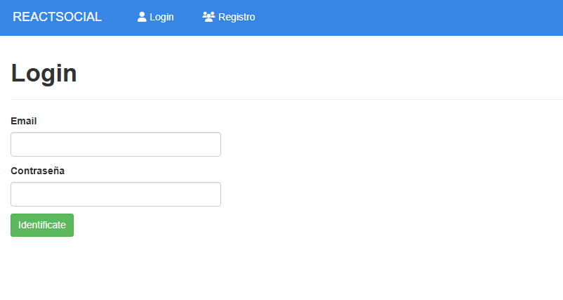
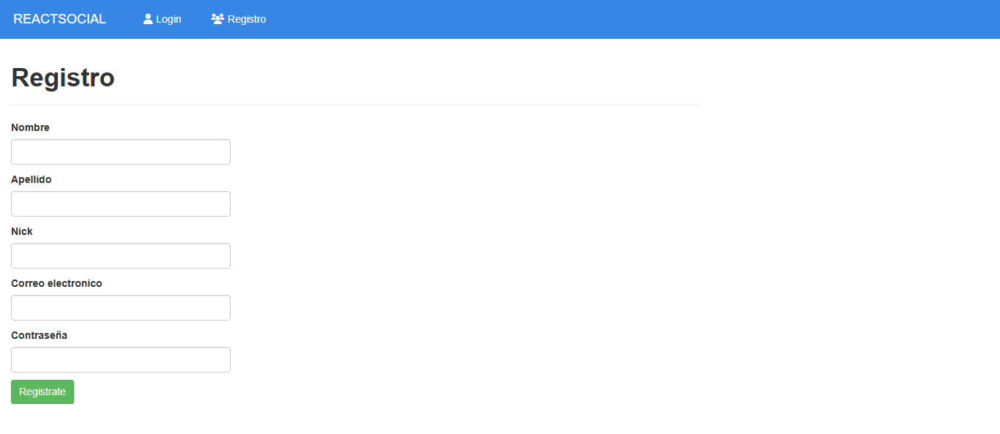
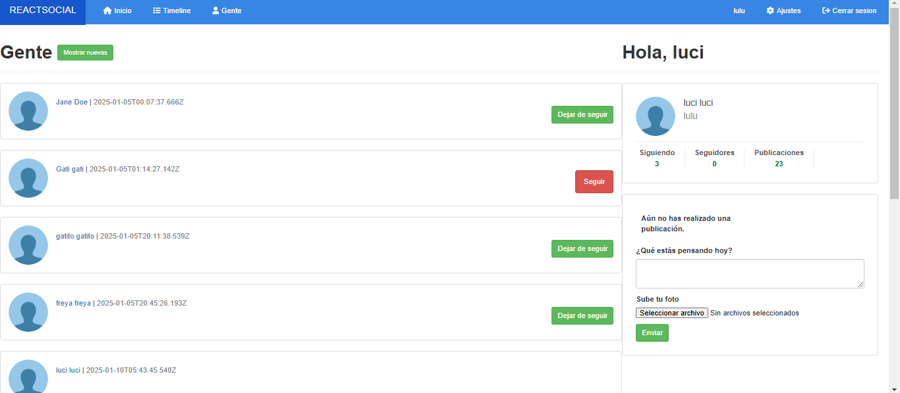
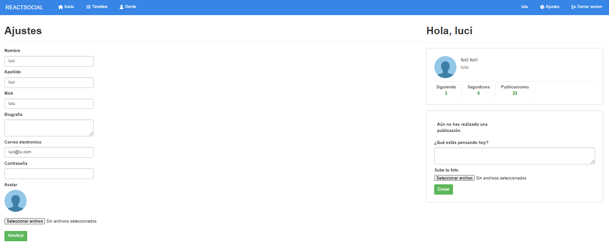
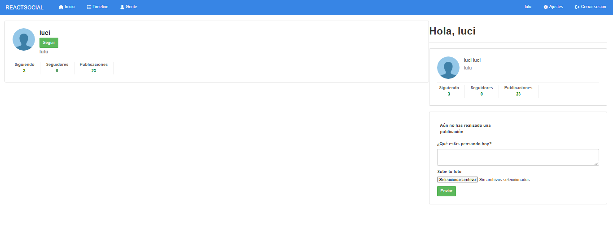

# Red Social-Backend 👥

Este backend es el núcleo de la red social, desarrollado con Node.js, Express y MongoDB. Gestiona usuarios, seguimientos, publicaciones y toda la información necesaria para el funcionamiento de la plataforma.

## Tabla de Contenidos

- [Características](#características)
- [Tecnologías](#tecnologías)
- [Instalación](#instalación)
- [Uso](#uso)
- [Capturas de Pantalla](#capturas-de-pantalla)
- [Contribuciones](#contribuciones)
- [Contacto](#contacto)

## Características 💬

- Registro y creación de usuarios.
  Inicio de sesión seguro (login).
  Actualización de perfil y manejo de imágenes. 📂

- Gestión de publicaciones:
  Crear, leer, actualizar y eliminar publicaciones.
  Subir archivos adjuntos.📰

- Seguimiento de usuarios:
  Seguir y dejar de seguir a otros usuarios.
  Ver lista de seguidores y seguidos.🔁

## Tecnologías 🌐

- **Node.js y Express**: Para el servidor backend.
- **MongoDB**: Como base de datos no relacional.
- **JWT (JSON Web Tokens)**: Para autenticación segura.
- **Multer**: Para la gestión de archivos.

## Instalación ⚙️

Antes de instalar, descargue e instale Node.js.☑️

1. Clona el repositorio:
 ```bash
   git clone https://github.com/freya-godoy/Red-Social-Backend.git
   ```
2. Instala dependencias del proyecto:

```sh
npm install
```

## interfaz 📲

Login👤


Registro👥


Comunidad🌍


Ajustes🔧


Perfil👩 👨


## Despliegue 📂

Despliegue desde la consola:

Backend

```sh
npm start
```

Frontend

```sh
npm run dev
```

## Contacto 📬

- Email: freya.godoy.20@hotmail.com
