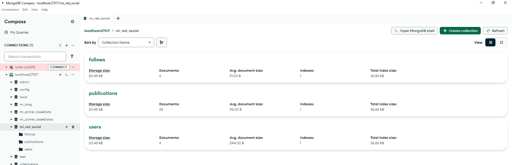
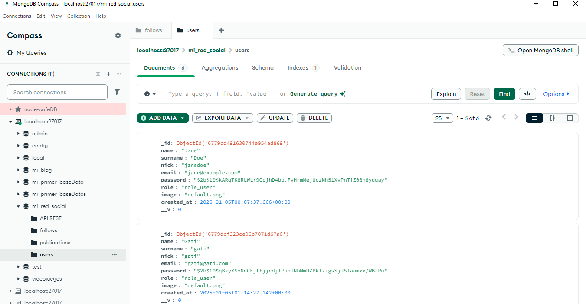
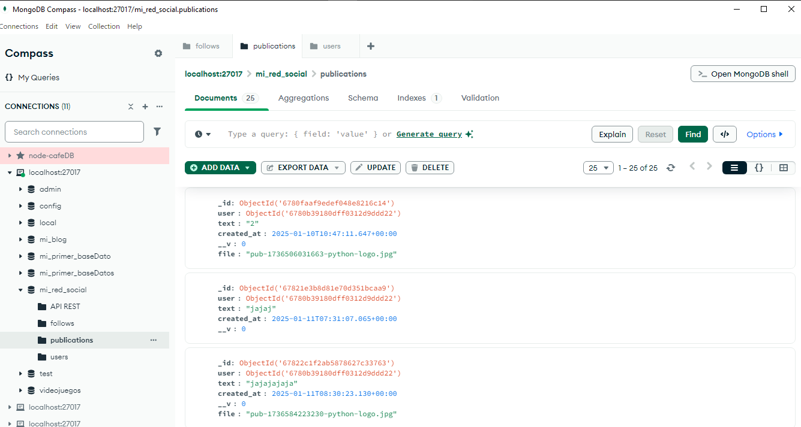
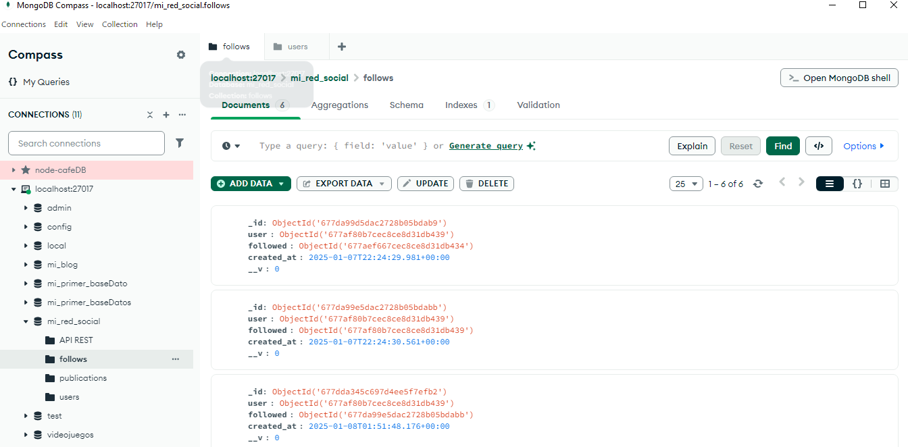
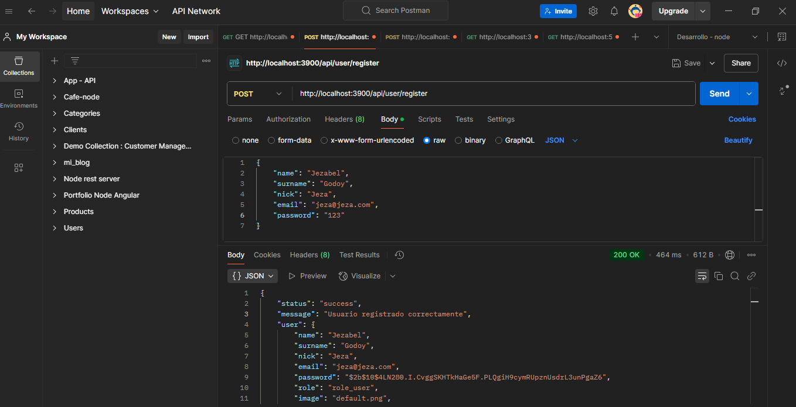
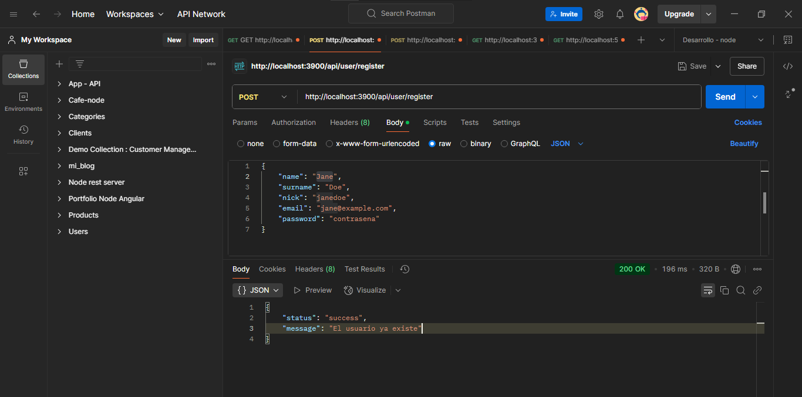

# Red Social-Backend 👥

Este backend es el núcleo de la red social, desarrollado con Node.js, Express y MongoDB. Gestiona usuarios, seguimientos, publicaciones y toda la información necesaria para el funcionamiento de la plataforma.

## Tabla de Contenidos

- [Características](#caracteristicas)
- [Tecnologías](#tecnologias)
- [Instalación](#instalacion)
- [Interfaz](#interfaz)
- [Despliegue](#despliegue)
- [Contacto](#contacto)

## Características 💬 <a id="caracteristicas"></a>

- Registro y creación de usuarios.
  Inicio de sesión seguro (login).
  Actualización de perfil y manejo de imágenes. 📂

- Gestión de publicaciones:
  Crear, leer, actualizar y eliminar publicaciones.
  Subir archivos adjuntos.📰

- Seguimiento de usuarios:
  Seguir y dejar de seguir a otros usuarios.
  Ver lista de seguidores y seguidos.🔁

## Tecnologías 🌐 <a id="tecnologias"></a>

- **Node.js y Express**: Para el servidor backend.
- **MongoDB**: Como base de datos no relacional.
- **JWT (JSON Web Tokens)**: Para autenticación segura.
- **Multer**: Para la gestión de archivos.

## Instalación ⚙️ <a id="instalacion"></a>

Antes de instalar, descargue e instale Node.js.☑️

1. Clona el repositorio:

```bash
  git clone https://github.com/freya-godoy/Red-Social-Backend.git
```

2. Instala dependencias del proyecto:

```sh
npm install
```

## Base de datos con MongoDB 📲 <a id="interfaz"></a>

Base de datos 🌐



Usuarios creados 👥



Publicaciones 📰



Follows 👥



## Pruebas API con Postman 🔧 <a id="interfaz"></a>

Usuario registrado ✔️



Prueba que valida si el usuario existe ✔️



## Despliegue 📂 <a id="despliegue"></a>

Despliegue desde la consola:

Backend

```sh
npm start
```

Frontend

```sh
npm run dev
```

## Contribuciones 👇

¡Las contribuciones son bienvenidas! Sigue estos pasos:

1. Haz un fork del repositorio.
2. Crea una rama nueva: `git checkout -b nueva-rama`.
3. Realiza tus cambios y haz un commit: `git commit -m "Descripción"`.
4. Sube los cambios: `git push origin nueva-rama`.
5. Abre un Pull Request.

## Contacto 📬 <a id="contacto"></a>

- Email: freya.godoy.20@hotmail.com
